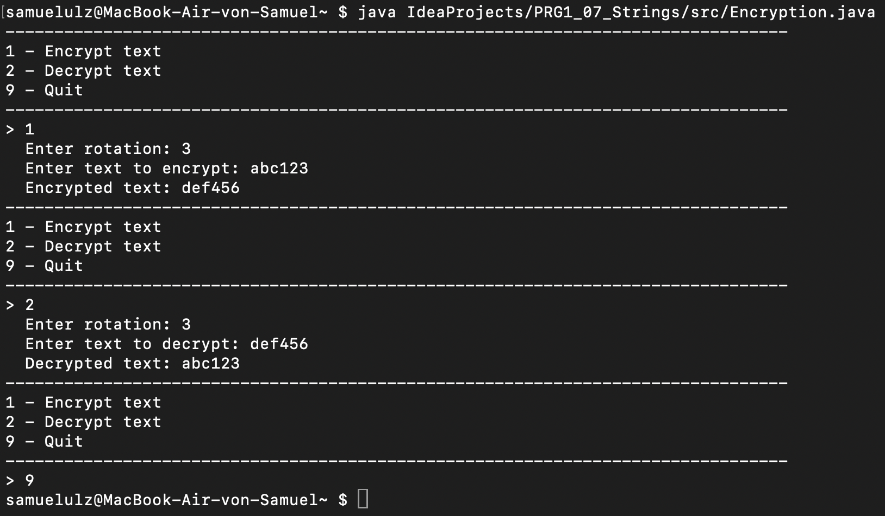

# Encryption

Encryption is a Java Class for encrypting or decrypting a string of letters or numbers by rotating them by a certain amount

## Installation

Use my program by simply downloading the Java class and typing \"java \<absolute or relative path of java class\> in your Terminal/Console\"\
in my case:
```bash
java //Users/samuelulz/IdeaProjects/PRG1_07_Strings/src/Encryption.java
```
or
```bash
cd IdeaProjects/PRG1_07_Strings/src
java Encryption.java
```

## Usage

- Type \"1\" to encrypt a string (rotates from A-Z and 0-9)
- Type \"2\" to decrypt a string (rotates backwards from Z-A and 9-0)
  - After typing \"1\" or \"2\" you will be asked to put in a number for how many chars you want to rotate your string
    - After entering your rotation, type any letters and/or numbers you want to encrypt or decrypt
- Type \"9\" to exit the program



## Contribution

If you have any further questions or suggestions on how to improve my program, feel free to write to my e-mail adress: s54090@edu.campus02.at.

## Link to exercise

- [Exercise1](./exercise1.md)
  - First exercise to try some basic markdown
- [Exercise2](./exercise2.md) 
  - Explanation of some basic git commands