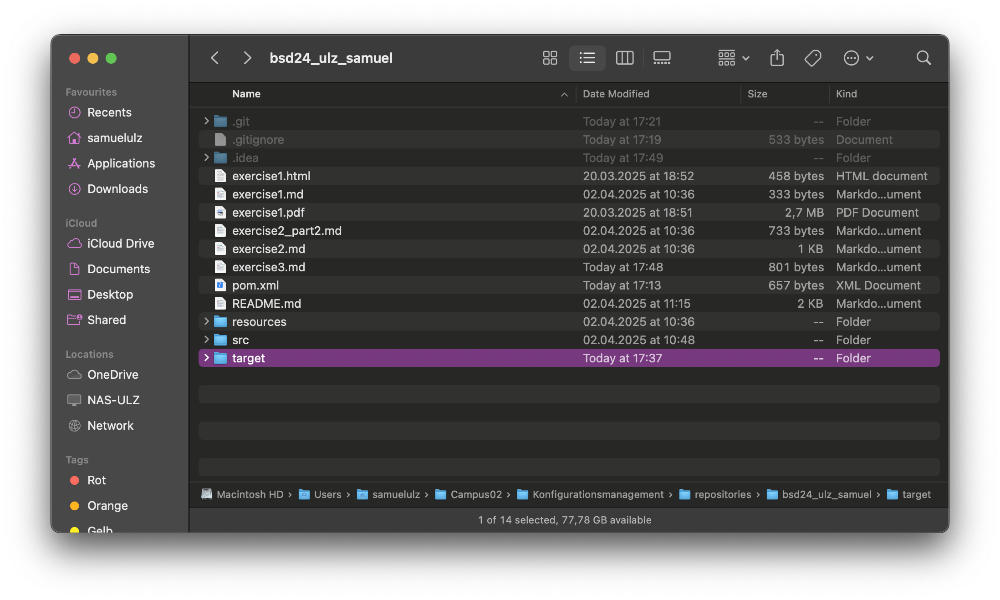
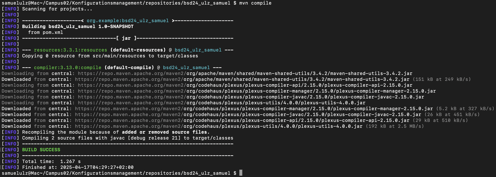

# Exercise 3

Short documentation of third exercise

## Documentation

First, I downloaded Maven and checked which Maven and Java Version I have:
- Apache Maven 3.9.9
- openjdk version \"21\" 2023-09-19
- javac 21

Then I set the correct environmental variables for \"PATH\" and \"JAVA_HOME\".

After that, I created a new branch \"init_project\".  
Then I created my maven project and commited my changed .gitignore and pom.xml file and pushed them on my new branch to my remote repository with the command \"git push origin -u init_project\".   
And finally I merged the branch in my main branch.  

Next, I switched to a new branch \"calculator\" and created two java classes \"Calculator.java\" and \"Main.java\" for my calculator project.  
After I first ran my main class, a new folder \"target\" appeared:
  
Then I implemented the maven-compiler-plugin and ran \”mvn compile\” in my console:
  
