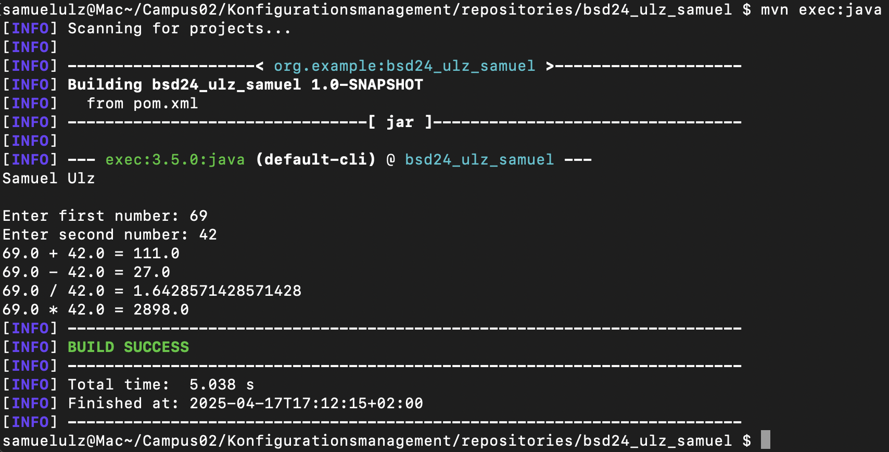
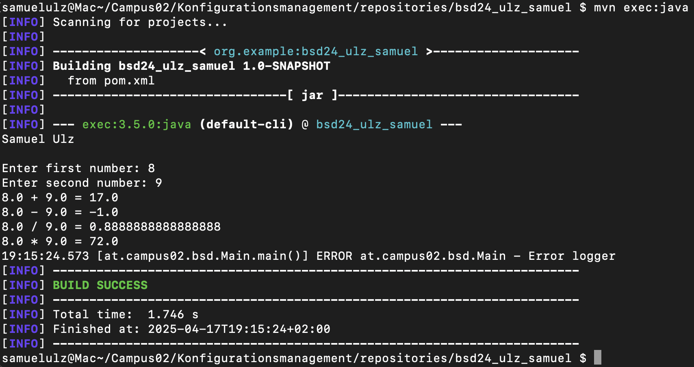
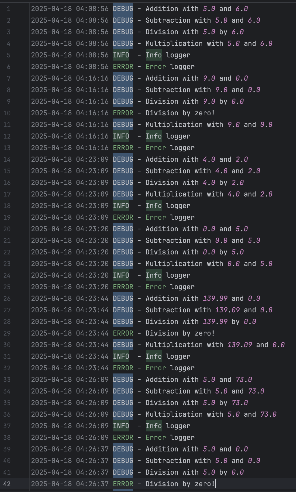

# Exercise 3

Short documentation of third exercise

## Documentation

First, I downloaded Maven and checked which Maven and Java Version I have:
- Apache Maven 3.9.9
- openjdk version \"21\" 2023-09-19
- javac 21

Then I set the correct environmental variables for \"PATH\" and \"JAVA_HOME\".

After that, I created a new branch \"init_project\".  
Then I created my maven project and commited my changed .gitignore and pom.xml file and pushed them on my new branch to my remote repository with the command \"git push origin -u init_project\".   
And finally I merged the branch in my main branch.  

Next, I switched to a new branch \"calculator\" and created two java classes \"Calculator.java\" and \"Main.java\" for my calculator project.  
After I first ran my main class, a new folder \"target\" appeared:
  
Then I implemented the maven-compiler-plugin and ran \”mvn compile\” in my console:
  

I ran my project in the console with the command \"mvn exec:java\":
  

I commited the changes on my new branch and submitted a pull request on GitHub to merge it in my main branch.  

### Logging library

First I made a new branch \"logging\" and implemented the log4j dependency in my pom.xml file.  
I then initialized a Logger object in my Main class and set two logger entries in the main method for Info and Error, I noticed that an error log will only be logged in the Error logger and not in Info:  
  

To change that, I created a config file \"log4j2.xml\" to append every new log entry in a log file and to correctly output them on my console.  
I copied the config file to \"log4j2.xml.template\" for reference in my remote repository and ran some tests to see the logs after creating a Logger object in my Calculator class as well and making debug loggers in every method (and an error logger dor divisions by zero).  
My \”myapp.log\" file:  
  

I finished by commiting my changes and making a pull request on GitHub.